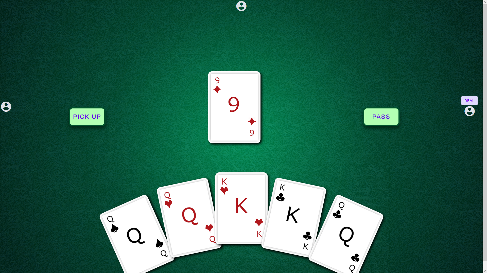

 

# Vue Euchre
    A Work in progress webpage based euchre game against ai

## Table of Contents
- #### [Description](##-description)
- #### [License](##-license)
- #### [Questions](##-questions)

## Description
    Currently, if you download and locally host the game, you can click the here button, and the deck will be pulled up, play a shuffle and deal animation then prompt each player to pass or pick up the top card.  If you click the pass button then it will prompt each player to pick a suit for trump, it is screw the dealer style euchre. The ai is tuned to always pass for both for easy testing but can be tuned to be more aggresive. The suit buttons do not work properly yet. If you click pick up during the top card rotation then the top card will be added to your hand and the game will pause until you click a card to discard, once chosen the card will be discarded and the hand will begin. You can play several rounds and for each one the cards will be scored and an animation will play to show the winner, it is still broken once you get down to two cards, so there is no way to finish a game.
    
### Structure
    This application has been created using vue.js. The main game files are all under app/scripts/views. 

##### App.vue
    Core of the application, stores global variables, carries messages, and handles longterm game states

##### gameTable.vue
    Contains all animations for main gameplay, e.g. shuffle, deal, playing cards. It also contains the player response buttons for trump call.

##### gameHandler.vue
    Manages the games animations and prompts.

##### hand.vue
    Holds the players hand and handles card choices.

##### Ai.vue
    Handles the Ai's choices for top card, trump call, and playing cards
### Ai 
#### score scheme
    the ai scores cards as shown here

                    9 = 9
                    10 = 10
                    Jack = 11
                    Queen = 12
                    King = 13
                    Ace = 14

    after if the card is a trump card its score is increased by 10 unless it is the left or the right which are increased by 14, and 15 respectively, so trump is scored like this

                    9 = 19
                    10 = 20
                    Queen = 22
                    King = 23
                    Ace = 24
                    Left = 25
                    Right = 26
#### Top Card Pick up
    For deciding to pick up or pass the top card the ai will score its whole hand with the top cards suit, and if its above a threshold will say pick up, as long as its not the dealer. If it is the dealer it will add the top card to a trial hand, subtract the lowest scored card, and then do the check.
#### Trump Call pick
    When prompted to make a choice on trump the ai will score its hand for each of the remaining three suits and then call the best option if its over a threshold
#### Playing Cards
    the ai will choose either the highest possible card if it has it, or a high non-trump if its going first, if its going second, third, or fourth it will follow suit, play its best card if it can win and its partner isn't winning, or its worst card if it can't win or its partner already is

## License
Copyright  2022  Kyle Costello
 
 Licensed under the Apache License, Version 2.0 (the "License");
 you may not use this file except in compliance with the License.
 You may obtain a copy of the License at
 
 http://www.apache.org/licenses/LICENSE-2.0
 
 Unless required by applicable law or agreed to in writing, software
 distributed under the License is distributed on an "AS IS" BASIS,
 WITHOUT WARRANTIES OR CONDITIONS OF ANY KIND, either express or implied.
 See the License for the specific language governing permissions and
 limitations under the License.

## Questions
If you have any questions regarding this project please feel free to reach out at 

-Email: kylec0217@gmail.com 
-GitHub Username: krestle80 